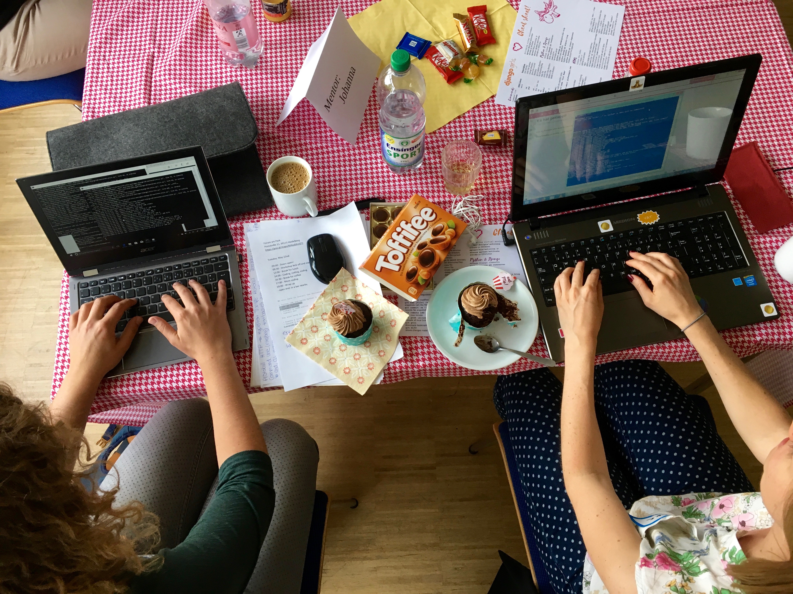
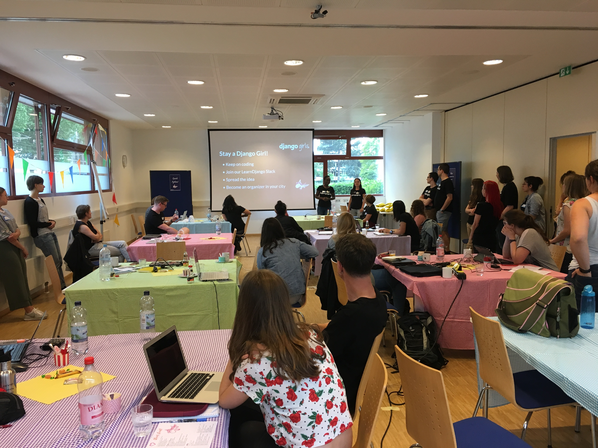
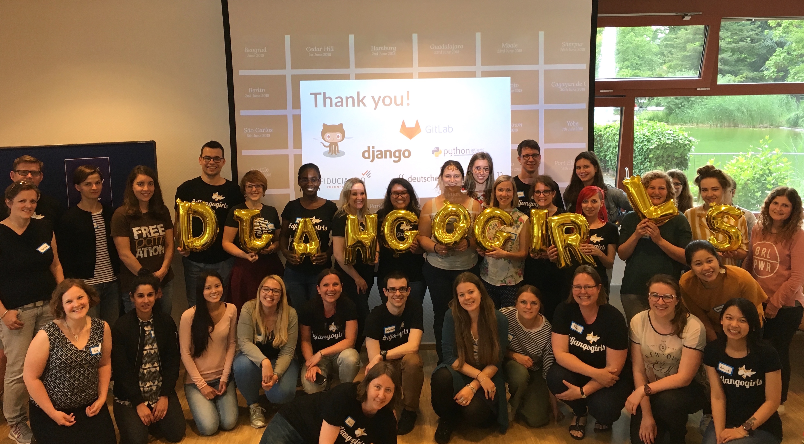

Du fragst dich, wie das Internet funktioniert, wie eine Webseite ins Netz kommt? Du möchtest selbst mal ausprobieren, einen Blog zu programmieren? Dann hast du jetzt die Chance: Wir veranstalten einen eintägigen Workshop für Anfänger!

Django Girls Heidelberg ist Teil der weltweiten, non-profit Initiative Django Girls. Wir glauben, dass wir alle stark davon profitieren, wenn sich mehr Frauen für Technologie begeistern. Wir bieten dir die Möglichkeit, in einer angenehmen Atmosphäre erste Erfahrungen mit Programmierung zu sammeln und eine von uns zu werden - eine Programmiererin!

Während des Workshops arbeitest du in kleinen Gruppen mit je 3 Frauen. Jede Gruppe wird von einem Coach begleitet. Die Coaches sind erfahrene Software-Entwicklerinnen oder Entwickler, die ehrenamtlich ihre Zeit, ihr Wissen und ihre Energie für Dich und Django Girls zur Verfügung stellen.

Der Workshop findet am Dienstag, 22. Mai 2018, in Heidelberg statt.

